  

<h1 align="center">Привет, я phasorix 👋</h1>

  
  

  

---

### 🎯 Обо мне

Студент **РТУ МИРЭА**, Институт радиоэлектроники и информатики.  
Направление: **Радиоинформатика, мониторинг и телеметрия**.  
Увлечён печатными платами, ПЛИС, физикой и программированием.

- 🔭 Сейчас работаю над проектом телеметрического модуля на FPGA
- 🌱 Изучаю высокоскоростные интерфейсы (JESD204B) и 3D-моделирование корпусов
- 📝 Пишу научные статьи по 3D-печати и деформациям
- 📫 Связаться со мной: [Email](mailto:phasorix1001@gmail.com)

---

### 🛠 Технологический стек

  
  

  

---

### 🚀 Мои проекты

#### 🔬 Научные статьи
- [📄 ИНТЕГРАЛЬНАЯ ОЦЕНКА ДЕФОРМАЦИИ ПРИ ПЕЧАТИ МОДЕЛИ: ОТ ТОЧКИ К ОБЪЁМУ](https://github.com/phasorix/phasorix/blob/main/9_Павлова_Аксенченко_статья_Интегральная_оценка_2.pdf)  
  *3D-печать, деформация, усадка, ABS-пластик, интегральная оценка.*

#### 🧠 ПЛИС (FPGA)
- [🔧 Лабораторная работа: Коррелятор сигналов на ПЛИС](https://github.com/phasorix/fpga-lab1)  
  *Verilog, Vivado, Xilinx Artix-7.*

#### 🖨️ Печатные платы
- [💻 Телеметрический модуль (в процессе)](https://github.com/phasorix/telemetry-pcb)  
  *KiCad, 4-слойная плата, приёмопередатчик.*

---

  Создано с ❤️ и паяльником

